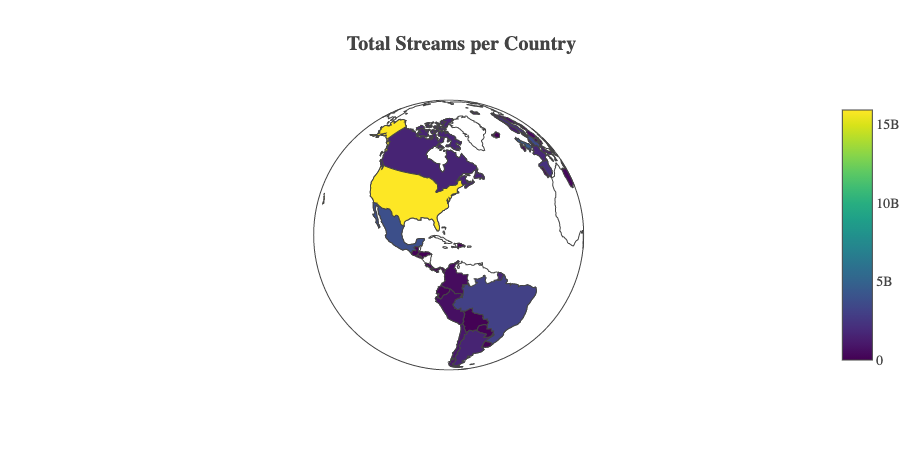
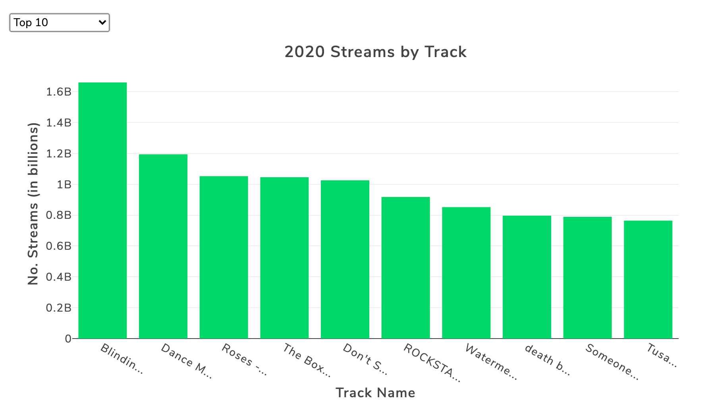
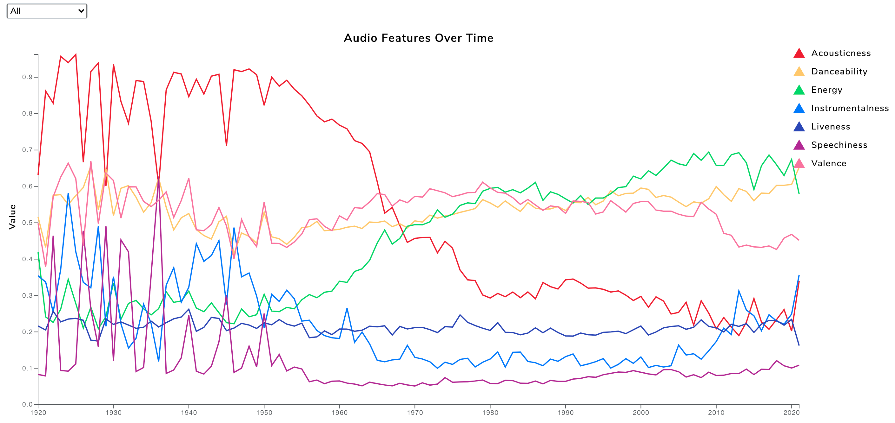
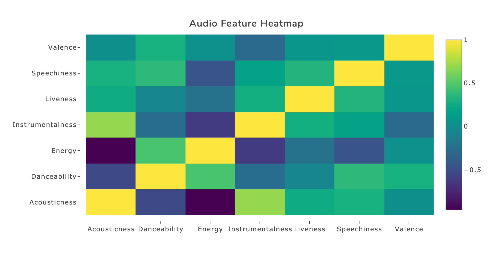

# Spotify Track Analysis Over Time

## https://alexarnold630.github.io/SMU_Project2/Spotify/index.html

## Background
Select a real-world dataset to analyze by using an interactive visualization dashboard.

## Technologies Used
- HTML/CSS
- JavaScript
- D3.js
- Plotly

## Objective
To determine if music (as measured through audio features) has changed over time and to determine which country streams the most music.

## Data
- Country Data: https://raw.githubusercontent.com/plotly/datasets/master/2014_world_gdp_with_codes.csv
- Kaggle Notebook: https://www.kaggle.com/yamaerenay/spotify-dataset-19212020-160k-tracks/notebooks
- Tableau Streams CSV: https://public.tableau.com/profile/glenn.cable#!/vizhome/Book5_1502/worldmap

## Hypotheses
- The United States is the country that streams the most music.
- Audio features, such as danceability and speechiness, have increased over time.

## Analysis
The world Choropleth Map illustrates the total number of Spotify streams for each country. The United States streams the most music with almost 16 billion streams.

The interactive bar chart displays the Top 10, Top 20, Bottom 10, and Bottom 20 of the most or least streamed tracks out of the Top 100 Global Tracks streamed week over week for the 52 weeks of 2020. Blinding Lights by the Weeknd was the most streamed track of 2020 by Spotify users.

The Audio Features Line Chart shows the change in audio features over time from 1920-present, which can also be filtered by decade. Based on the visualization, these audio features have changed over time with a significant change shown between 1960-1970.

The Audio Feature Heatmap is also filtered by the 1920-present time period and by decade. It highlights the relationships between the audio features. Over the entire time range, Instrumentalness and Acousticness have the strongest correlation amongst the audio features; while, Energy and Acousticness have the weakest.

The Scatterplot highlights the relationships between the Audio Features of Popularity in relation to Danceability, Energy, and Valence over time. These features were investigated further with this visualization as these were the highest scored features over time as shown by the line chart. After the 1940s, danceability increases as a track's popularity increases showing a slightly positive correlation over time.  There is a positive correlation between energy and popularity over time highlighting that the most popular tracks are energetic. The year 2021 is currently an outlier as we do not have a complete dataset of this current year. Popularity and valence is scattered over time illustrating a no correlation.

## Conclusions
- The United States is the country that streams the most Spotify music.
- Speechiness has not increased over time while Danceability has increased over time.

### Contact:
Alex Arnold: alexnarnold630@gmail.com  
Scott Frazier  
Samantha Lane  
Jenette Smith